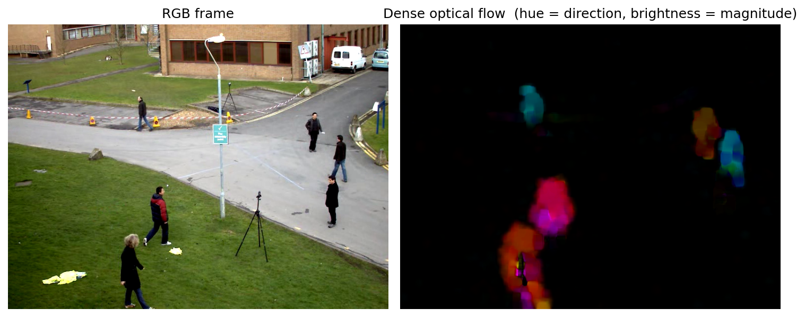

# FlowCLIP: ActionCLIP with Learnable Optical Flow

PyTorch implementation of **FlowCLIP**, an extension of *ActionCLIP: A New Paradigm for Video Action Recognition* [[arXiv]](https://arxiv.org/abs/2109.08472) with a learnable optical-flow modality for fine-grained human-action recognition.

## About this Repository

FlowCLIP builds on the original ActionCLIP codebase and adds **optical flow** as a complementary temporal modality alongside RGB. The repository contains the modified architecture, training/testing pipeline, and an HMDB-51 demonstration workflow (30-epoch fine-tuning of ViT-B/16 on a Kinetics-400 backbone with Transformer fusion, evaluated at 256 px resolution and reporting Top-1/Top-5 accuracy on HMDB-51). A Colab notebook is also provided for zero-shot inference on a single video using the pretrained K400 backbone.

## Updates
- **2026.05**: Added **optical flow** support as a complementary temporal modality (FlowCLIP). See the [Optical Flow](#optical-flow) section for details.
- 2022.01: Add the trained model download link of [google driver](https://drive.google.com/drive/folders/1qs5SzQIl__qo2x9h0YudpGzHhNnPGqK6?usp=sharing).

## Overview

FlowCLIP keeps ActionCLIP's RGB + text contrastive backbone and adds a parallel optical-flow
stream, fused with a learnable scalar α before the similarity loss:

```mermaid
flowchart LR
    V([Videos]):::vid --> VE[Video Encoder]:::vid --> VR[Video<br/>Representations]:::vid
    F([Optical Flow]):::flow --> FE["FlowCLIP Encoder<br/>2&#8594;3 Conv2d"]:::flow --> FR[Flow<br/>Representations]:::flow
    L([Labels]):::txt --> TE[Text Encoder]:::txt --> TR[Text<br/>Representations]:::txt

    VR --> A(("&alpha; Fusion<br/>learnable scalar")):::fuse
    FR --> A
    A --> FZ[Fused RGB+Flow<br/>Representation]:::fuse

    FZ --> SIM{{Similarity<br/>Calculation}}:::sim
    TR --> SIM
    SIM --> MAT[Similarity Matrix]:::sim
    MAT -->|KL Loss| GT[/Ground-truth<br/>diagonal/]:::gt

    classDef vid fill:#cfe0fb,stroke:#3b6fb6,color:#13314f;
    classDef flow fill:#cdeccd,stroke:#3f9142,color:#163a18;
    classDef txt fill:#f8d0d0,stroke:#c0504d,color:#4f1717;
    classDef fuse fill:#fde2c0,stroke:#e08e2b,color:#6b3d05;
    classDef sim fill:#e7e2f3,stroke:#7a6bb0,color:#2c2350;
    classDef gt fill:#ffffff,stroke:#555555,color:#222222;
```



**New in FlowCLIP** (green / orange): the **FlowCLIP Encoder** — a learnable 2&#8594;3 `Conv2d` that
projects optical-flow (x, y) maps into the shared CLIP ViT image encoder — and the **learnable α
fusion** that blends the RGB and flow representations (`fused = α·rgb + (1−α)·flow`, with α clamped
to [0, 1]) before the contrastive similarity loss. Each stream has its own temporal Transformer
head; fusion is performed on the resulting clip-level embeddings (late fusion).

## Content
- [Prerequisites](#prerequisites)
- [Data Preparation](#data-preparation)
- [Optical Flow](#optical-flow)
- [Updates](#updates)
- [Pretrained Models](#pretrained-models)
  * [Kinetics-400](#kinetics-400)
  * [Hmdb51 && UCF101](#HMDB51&&UCF101)
- [Testing](#testing)
- [Training](#training)
- [Maintainer](#maintainer)
- [Contributors](#Contributors)
- [Citing_ActionClip](#Citing_ActionCLIP)
- [Acknowledgments](#Acknowledgments)

## Prerequisites

The code is built with following libraries:

- [PyTorch](https://pytorch.org/) >= 1.8
- [wandb](https://wandb.ai/)
- RandAugment
- pprint
- tqdm
- dotmap
- yaml
- csv
- [OpenCV](https://opencv.org/) (Farneback dense optical flow, used for flow extraction)

For video data pre-processing, you may need [ffmpeg](https://www.ffmpeg.org/).

More detail information about libraries see [INSTALL.md](INSTALL.md).

## Data Preparation

We need to first extract videos into frames for fast reading. Please refer to [TSN](https://github.com/yjxiong/temporal-segment-networks) repo for the detailed guide of data pre-processing.

We have successfully trained on [Kinetics](https://deepmind.com/research/open-source/open-source-datasets/kinetics/), [UCF101](http://crcv.ucf.edu/data/UCF101.php), [HMDB51](http://serre-lab.clps.brown.edu/resource/hmdb-a-large-human-motion-database/), [Charades](https://prior.allenai.org/projects/charades).

## Optical Flow

FlowCLIP introduces optical flow as an additional temporal modality on top of the RGB stream used by ActionCLIP. The flow stream captures motion cues that complement appearance features, improving recognition on motion-intensive action classes.

<p align="center">
  
</p>
<p align="center"><em>An RGB frame (left) and its dense optical flow (right), HSV-coded so hue encodes motion direction and saturation encodes magnitude. The flow stream isolates the moving subject from the static background.</em></p>

### Extracting Optical Flow

Use the helper in `datasets/flow_utils.py` to pre-compute per-frame optical flow from the decoded RGB frames. It uses OpenCV's Farneback dense optical flow and writes the `flow_x_*.jpg` / `flow_y_*.jpg` pairs expected by the dataset loader:

```python
from datasets.flow_utils import compute_optical_flow

# Run per video directory of RGB frames:
compute_optical_flow(
    video_dir='/path/to/rgb_frames/<video_id>',
    output_dir='/path/to/flow_frames/<video_id>',
)
```

### Directory Structure

```
data/
  rgb_frames/<video_id>/img_00001.jpg ...
  flow_frames/<video_id>/flow_x_00001.jpg, flow_y_00001.jpg ...
```

### Training with Optical Flow

Enable the flow stream in the YAML config:

```yaml
data:
  use_flow: True
  flow_tmpl: 'flow_{}_{:05d}.jpg'
  flow_root: '/path/to/optical/flow/frames'
```

Then launch training with the flow-enabled config:

```
# train with optical flow
bash scripts/run_train.sh ./configs/hmdb51/hmdb_flow.yaml
```

**Notes**
- Flow frames are stored as JPEG (x and y components in separate files).
- RGB and flow are combined via **late fusion**: each stream is encoded and temporally aggregated independently, then blended with a learnable scalar α (`fused = α·rgb + (1−α)·flow`, α clamped to [0, 1]) before the contrastive loss.
- The flow stream improves accuracy on motion-intensive classes.

## Pretrained Models

Training video models is computationally expensive. Here we provide some of the pretrained models. We provide a large set of trained models in the ActionCLIP [MODEL_ZOO.md](MODEL_ZOO.md).

### Kinetics-400

We experiment ActionCLIP with different backbones(we choose Transf as our final visual prompt since it obtains the best results) and input frames configurations on k400. Here is a list of pre-trained models that we provide (see Table 6 of the paper). *Note that we show the 8-frame ViT-B/32 training log file in [ViT32_8F_K400.log](logs/ViT32_8F_K400.log).

| model | n-frame | top1 Acc(single-crop) | top5 Acc(single-crop)| checkpoint |
| :-----------------: | :-----------: | :-------------: |:-------------: |:---------------------------------------------------------: |
|ViT-B/32 | 8 | 78.36% | 94.25%|[link](https://pan.baidu.com/s/1NOKtVG6wxCrKvZ12IAofSQ) pwd:b5ni |
ViT-B/16 | 8 | 81.09% | 95.49% |[link](https://pan.baidu.com/s/1alr0JNF5sdcU3jtCpT0Bow) pwd:hqtv |
ViT-B/16 | 16 | 81.68% | 95.87% |[link](https://pan.baidu.com/s/1iWpuUzML3gfxq-4KrwIO5A) pwd:dk4r |
ViT-B/16 | 32 |82.32% | 96.20% |[link](https://pan.baidu.com/s/1hnmFQcoe6ii_mU7BzeTL5Q) pwd:35uu

### HMDB51 && UCF101
On HMDB51 and UCF101 datasets, the accuracy(k400 pretrained) is reported under the accurate setting.
#### HMDB51

| model | n-frame | top1 Acc(single-crop) | checkpoint |
| :-----------------: | :-----------: | :-------------: |:---------------------------------------------------------: |
|ViT-B/16 | 32 | 76.2% | [link]()

#### UCF101

| model | n-frame | top1 Acc(single-crop) | checkpoint |
| :-----------------: | :-----------: | :-------------: |:---------------------------------------------------------: |
|ViT-B/16 | 32 | 97.1% | [link]()

## Testing
To test the downloaded pretrained models on Kinetics or HMDB51 or UCF101, you can run `scripts/run_test.sh`. For example:
```
# test
bash scripts/run_test.sh  ./configs/k400/k400_test.yaml
```

### Zero-shot
We provide several examples to do zero-shot validation on kinetics-400, UCF101 and HMDB51.
- To do zero-shot validation on Kinetics from CLIP pretrained models, you can run:
```
# zero-shot
bash scripts/run_test.sh  ./configs/k400/k400_ft_zero_shot.yaml
```

- To do zero-shot validation on UCF101 and HMDB51 from Kinetics pretrained models, you need first prepare the k400 pretrained model and then you can run:
```
# zero-shot
bash scripts/run_test.sh  ./configs/hmdb51/hmdb_ft_zero_shot.yaml
```

## Training
We provided several examples to train ActionCLIP with this repo:
- To train on Kinetics from CLIP pretrained models, you can run:
```
# train
bash scripts/run_train.sh  ./configs/k400/k400_train.yaml
```

- To train on HMDB51 from Kinetics400 pretrained models, you can run:
```
# train
bash scripts/run_train.sh  ./configs/hmdb51/hmdb_train.yaml
```

- To train on UCF101 from Kinetics400 pretrained models, you can run:
```
# train
bash scripts/run_train.sh  ./configs/ucf101/ucf_train.yaml
```

- To train with **optical flow** (FlowCLIP) on HMDB51, you can run:
```
# train with optical flow
bash scripts/run_train.sh  ./configs/hmdb51/hmdb_flow.yaml
```

More training details, you can find in [configs/README.md](configs/README.md)

## Maintainer

This FlowCLIP repository is maintained by **Srikanth Baride** and is derived from the original ActionCLIP codebase by Mengmeng Wang and Jiazheng Xing.

## Contributors
ActionCLIP is written and maintained by [Mengmeng Wang](https://sallymmx.github.io/) and [Jiazheng Xing](https://april.zju.edu.cn/team/jiazheng-xing/).

## Citing ActionCLIP
If you find ActionClip useful in your research, please cite our paper.

# Acknowledgments
Our code is based on [CLIP](https://github.com/openai/CLIP) and [STM](https://openaccess.thecvf.com/content_ICCV_2019/papers/Jiang_STM_SpatioTemporal_and_Motion_Encoding_for_Action_Recognition_ICCV_2019_paper.pdf).
